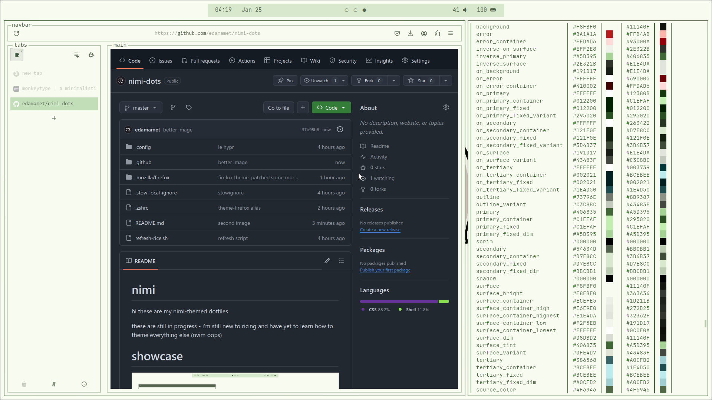

# nimi
hi these are my nimi-themed dotfiles

**these are still in progress** - i'm still new to ricing and have yet to learn how to theme everything else (nvim oops)

# showcase

> this wallpaper was made by [ShibeDraws](https://danbooru.donmai.us/posts/8745834)



# grains 
> because rice is composed of grains

| util | package |
| --- | --- |
| wm | hyprland |
| terminal | kitty |
| shell | zsh |
| font | jetbrains mono + cascadia code |
| browser | firefox ([textfox](https://github.com/adriankarlen/textfox) theme) |
| colours | matugen |
| editor | nvim |
| menu | wofi |
| titlebar | [hyprbars](https://hyprland.org/plugins/hyprbars/) |
| bar | waybar |
| notification | mako |
| wall | swww |

if you're planning on [installing this rice](#additional-information), the following 
**non-essential** (not riced (yet)) packages are used in my 
[zshrc](https://github.com/edamamet/nimi-dots/blob/master/.zshrc) and 
[hyprland config](https://github.com/edamamet/nimi-dots/blob/master/.config/hypr/hyprland.conf), 
but won't cause huge problems if you don't have them installed.  

```
thunar hyprshot feh tree
```

# additional information
### using this rice
i highly doubt anyone will try running this rice on bare metal, but just in case,
i did provide some very basic tools. 

if you're a newbie like me, i'd **highly** recommend using a dotfile/symlink manager. this rice 
was configured with [`stow`](https://archlinux.org/packages/extra/any/stow/), but the manager 
doesn't really matter, just make sure to [ignore the same files](https://github.com/edamamet/nimi-dots/blob/master/.stow-local-ignore).

```
git clone https://github.com/edamamet/nimi-dots.git

# if it's your first time using stow:
stow nimi 

# if you're already using stow, use the following command
stow --override='.*?' --adopt nimi
git restore .
```

### refreshing everything (wallpaper, bar, hyprland, etc.)
the hyprland config has a bind `mod + b` that will run the [refresh script](https://github.com/edamamet/dotfiles/blob/nimi/refresh-rice.sh) that'll take care of (mostly) everything, except for firefox.

### firefox
the firefox color theme is the exception. you can install it with [this link](https://color.firefox.com/?theme=XQAAAALuAwAAAAAAAABBKYhm849SCicxcUapi38oKRicm6da8pvkvB3S2AgG4kJ875br_76UUjd77ueS_P_cSKnTB_pYaXhspuz-5e3Tw2D6S8U-A09ql1HKtA5_j04CuV-F6skLIRIRUJdrzsoU3PCHTLpVZKzRQSRwqwsbndHALDOaCKLihNnZLazieAts34XJ6JhhoEe9eeCvHQUDiUD-KXBB3v0etQhIomL2DvF8nkkYxorIu1JUu0wENbKAtQwF7yt_jXj_22BGLnU4fdaw9zhd41VG2FcdKQb9OL4-fY12zKeARoIVD0-x_fJKYKqJGBy8umGnUISitIteoxlbpr6yly5j2cSN4ACfIg0nh2dcBq9KQ3qn4roq1JMxFe8frZ1oOeb7r3wGoa31yLnlVg7_qmGJI4pRvITXqK37aUcrkCEdnLpN8E2PKjtHeS6KtD65szRsonMAPAn4o8vnA-WbXElckbH3Qvvskkt1NDsRbEqjpKvxpu5eJ-MUTVtYoccAkyj1Qhw5F29mUZGZLf_zvVyi) or with a [script](./.mozilla/firefox/theme.sh)
that does it for you (so you don't need to open this page to install it):
```
# allow execution of the script
chmod +x .mozilla/firefox/theme.sh

./.mozilla/firefox/theme.sh
```

for convenience, you can also use the `theme-firefox` alias (as long as `theme.sh` has execute perms):
```
theme-firefox
```

### keybinds
there are a lot of keybinds, but the bare minimum you'll need are:
> mod is your windows key (probably)

| bind | action |
| --- | --- |
| mod + enter | kitty |
| mod + space | wofi |
| mod + e | thunar |
| mod + b | refresh everything* |

you can find the rest at [`~/.config/hypr/hyprland.conf`](https://github.com/edamamet/nimi-dots/blob/master/.config/hypr/hyprland.conf)

### nimifox ascii
if you want the nimifox ascii and you already have [textfox](https://github.com/adriankarlen/textfox) installed (currently working on a script that can do the following):

1. find the defaults.css folder:
```
find ~/.mozilla -name '*defaults.css'
```

2. replace the string inside `--tf-newtab-logo` with the following:
```
          _           _ ____           \A    ____  (_)___ ___  (_) __/___  _  __\A   / __ \\/ / __ `__ \\/ / /_/ __ \\| |/_/\A  / / / / / / / / / / / __/ /_/ />  <  \A /_/ /_/_/_/ /_/ /_/_/_/  \\____/_/|_|
```

### removing this rice
use your dotfile manager to de-symlink everything:
```
stow -D nimi
```
