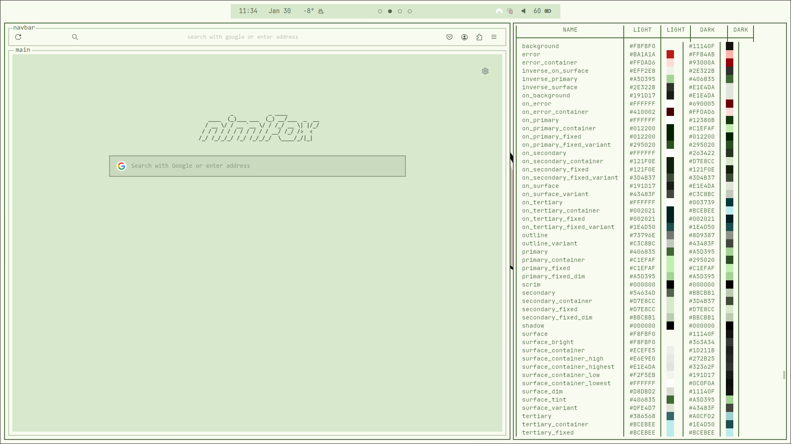

# nimi
hi these are my nimi-themed dotfiles

**these are still in progress** - i'm still new to ricing and have yet to learn how to theme everything else (nvim oops)

# showcase

> this wallpaper was made by [ShibeDraws](https://danbooru.donmai.us/posts/8745834)



# grains 
> because rice is composed of grains

| util | package |
| --- | --- |
| wm | hyprland |
| terminal | kitty |
| shell | zsh |
| font | jetbrains mono + cascadia code |
| browser | firefox ([textfox](https://github.com/adriankarlen/textfox) theme) |
| files | thunar |
| colours | matugen |
| editor | nvim |
| launcher | wofi |
| titlebar | [hyprbars](https://hyprland.org/plugins/hyprbars/) |
| bar | waybar |
| notification | mako |
| wall | swww |
| lock | hyprlock |

if you're planning on [installing this rice](#additional-information), the following packages are also used
```
# required
zoxide

# optional
hyprshot feh tree wttrbar
```

# additional information

<details>
<summary>installing this rice (no risk!) (super duper beginner friendly!)</summary>

<br>

> this installation guide uses stow/symlink managers. if you don't 
know what that is, keep reading. if you're not a stow user, 
or you use nixos, you can install it the old-fashioned way, 
but it's not covered here. you probably don't need an installation guide anyway

i highly doubt anyone will try running this rice on bare metal, but if you would like to, 
there's no risk in losing **anything** as long as you back up your dotfiles (it's easy). 

<details>
<summary>if you've never backed up dotfiles</summary>

<br>

you can use a dotfile/symlink manager to backup your config. 
the one this rice is configured with is 
[`stow`](https://archlinux.org/packages/extra/any/stow/), but 
choose whichever one you'd like

### stow basics

1. make dotfiles directory at $HOME (`~/dotfiles`)
2. make subdirectory for your config (~/dotfiles/your-dots)
3. copy the configs you'd like to backup into `your-dots`
> make sure the dots appear <b>exactly as they appear at
$HOME</b>
```
# $HOME
├── .config
│   └── hypr
│       └── hyprland.conf
└── .zshrc

# your-dots
├── .config
│   └── hypr
│       └── hyprland.conf
└── .zshrc
```

4. commit your dotfiles to version control
```
# ~/dotfiles/your-dots
git init
git add .
git ci -m 'yuh'
```
5. navigate back to the dotfiles directory and stow
```
# ~/dotfiles
stow your-dots --adopt
cd your-dots
git restore .
```
</details>

navigate to your ~/dotfiles directory

> if your dotfiles directory is not at $HOME (/home/you/dotfiles), add the `-t $HOME` argument to the stow command

```
# ~/dotfiles
git clone https://github.com/edamamet/nimi-dots.git
```

```
# force stow nimi-dots
stow --override='.*?' --adopt nimi-dots
cd nimi-dots
git restore .
```

all you need to do now is hit `super + b` to refresh the rice. this will run the [refresh script](https://github.com/edamamet/dotfiles/blob/nimi/refresh-rice.sh) that'll take care of (mostly) everything, except for firefox, which is covered below.

> after refreshing, you'll have access to the `fstow` alias, which does the `stow --override='.*?' --adopt` command.
you can now use `fstow your-dots` to go back to your rice **as long as both are under the same parent directory, otherwise it will not work**

<details>
<summary id="uninstall">want to uninstall the rice?</summary>

<br>

switch back to your dotfiles, then get rid of mine:
```
# ~/dotfiles
fstow your-dotfiles
stow -D nimi-dots
rm -rf nimi-dots
```

</details>
</details>

<details>
<summary>firefox</summary>

<br>

the tui look is [textfox](https://github.com/adriankarlen/textfox)

the firefox color theme can be installed it with [this link](https://color.firefox.com/?theme=XQAAAALuAwAAAAAAAABBKYhm849SCicxcUapi38oKRicm6da8pvkvB3S2AgG4kJ875br_76UUjd77ueS_P_cSKnTB_pYaXhspuz-5e3Tw2D6S8U-A09ql1HKtA5_j04CuV-F6skLIRIRUJdrzsoU3PCHTLpVZKzRQSRwqwsbndHALDOaCKLihNnZLazieAts34XJ6JhhoEe9eeCvHQUDiUD-KXBB3v0etQhIomL2DvF8nkkYxorIu1JUu0wENbKAtQwF7yt_jXj_22BGLnU4fdaw9zhd41VG2FcdKQb9OL4-fY12zKeARoIVD0-x_fJKYKqJGBy8umGnUISitIteoxlbpr6yly5j2cSN4ACfIg0nh2dcBq9KQ3qn4roq1JMxFe8frZ1oOeb7r3wGoa31yLnlVg7_qmGJI4pRvITXqK37aUcrkCEdnLpN8E2PKjtHeS6KtD65szRsonMAPAn4o8vnA-WbXElckbH3Qvvskkt1NDsRbEqjpKvxpu5eJ-MUTVtYoccAkyj1Qhw5F29mUZGZLf_zvVyi) 
or with a [script](./.mozilla/firefox/theme.sh) that does it for you (so you don't need to open this page to install it):
```
# allow execution of the script
chmod +x .mozilla/firefox/theme.sh

./.mozilla/firefox/theme.sh
```

for convenience, you can also use the `theme-firefox` alias (as long as `.mozilla/firefox/theme.sh` has execute perms):
```
theme-firefox
```

### nimifox ascii

if you want the nimifox ascii (firefox startup ascii) and you already have 
[textfox](https://github.com/adriankarlen/textfox) installed (currently working on a script that can do the following):

1. find and open defaults.css. the location can be found by running the following:
```
find ~/.mozilla -name '*defaults.css'
```

2. replace the string inside `--tf-newtab-logo` with the following:
```
          _           _ ____           \A    ____  (_)___ ___  (_) __/___  _  __\A   / __ \\/ / __ `__ \\/ / /_/ __ \\| |/_/\A  / / / / / / / / / / / __/ /_/ />  <  \A /_/ /_/_/_/ /_/ /_/_/_/  \\____/_/|_|
```

</details>

<details>
<summary>keybinds (enough to get you started)</summary>

<br>

there are a lot of keybinds, but the bare minimum you'll need are:
> super is your windows key (probably)

| bind | action |
| --- | --- |
| super + enter | terminal |
| super + space | app launcher |
| super + e | file explorer |
| super + b | refresh everything* |

you can find the rest at [`~/.config/hypr/hyprland.conf`](https://github.com/edamamet/nimi-dots/blob/master/.config/hypr/hyprland.conf)


</details>
